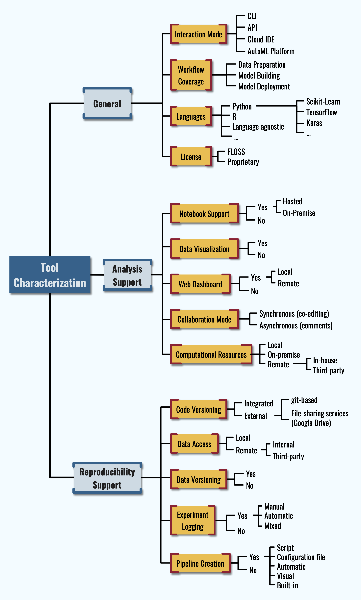

# Software Solutions for Reproducible ML Experiments

This repository contains auxiliary material for the article: ["A Taxonomy of Tools for Reproducible Machine Learning Experiments"](http://ceur-ws.org/Vol-3078/paper-81.pdf) by Luigi Quaranta, Fabio Calefato, and Filippo Lanubile.

In the following of this README, the full sample of analyzed tools is classified according to the features from the taxonomy presented in the paper; for the reader's convenience, a figure representing the taxonomy is also displayed in the following paragraph.

 The tool categorization reported in this README as well as the figure representing the taxonomy are licensed under a <a rel="license" href="http://creativecommons.org/licenses/by/4.0/">Creative Commons Attribution 4.0 International License</a>.

Please, include the following citation if you intend to (re)use our work:

> L. Quaranta, F. Calefato and F. Lanubile, *“A Taxonomy of Tools for Reproducible Machine Learning Experiments,”* Proceedings of the AIxIA 2021 Discussion Papers Workshop (AIxIA DP 2021), 2021, pp. 65-76, online: [CEUR-WS.org/Vol-3078/paper-81.pdf](http://ceur-ws.org/Vol-3078/paper-81.pdf).

## The Taxonomy

 

## Tools Review

### General

The tool sample classified according to the features of the General category.

<table>
<thead>
  <tr>
    <th></th>
    <th>Interaction Mode</th>
    <th>Workflow Coverage</th>
    <th>Languages</th>
    <th>License</th>
  </tr>
</thead>
<tbody>
  <tr>
    <td><a href="https://dvc.org/">DVC</a></td>
    <td>CLI</td>
    <td>All</td>
    <td>Language agnostic</td>
    <td>FLOSS (Apache 2.0)</td>
  </tr>
  <tr>
    <td><a href="http://guild.ai/">Guild AI</a></td>
    <td>CLI, API</td>
    <td>Data Preparation + Model Building</td>
    <td>Python  Built-in framework support: TensorFlow, PyTorch, Keras, Scikit-Learn</td>
    <td>FLOSS (Apache 2.0)</td>
  </tr>
  <tr>
    <td><a href="https://www.pachyderm.com/">Pachyderm</a></td>
    <td>CLI, API</td>
    <td>All</td>
    <td>Language agnostic</td>
    <td>Community Ed.: FLOSS (Apache 2.0) Enterprise Ed.: Proprietary</td>
  </tr>
  <tr>
    <td><a href="http://comet.ml/">Comet.ml</a></td>
    <td>API, CLI</td>
    <td>Data Preparation + Model Building</td>
    <td>Python, R, Java (beta)  Built-in framework support: TensorFlow, PyTorch, Keras, Scikit-Learn, SageMaker</td>
    <td>Proprietary</td>
  </tr>
  <tr>
    <td><a href="https://mlflow.org/">MLflow</a></td>
    <td>API, CLI</td>
    <td>All</td>
    <td>Python, R, Java  Built-in framework support: Apache Spark, TensorFlow, PyTorch, Keras, Scikit-Learn, H2O</td>
    <td>FLOSS (Apache 2.0)</td>
  </tr>
  <tr>
    <td><a href="https://neptune.ai/">Neptune</a></td>
    <td>API, CLI</td>
    <td>All</td>
    <td>Language agnostic (CLI)  Python and R (API)  Built-in framework support: TensorFlow, PyTorch, Keras MLflow, SageMaker</td>
    <td>Proprietary</td>
  </tr>
  <tr>
    <td><a href="https://www.wandb.com/">wandb</a></td>
    <td>API, CLI</td>
    <td>Data Preparation + Model Building</td>
    <td>Python</td>
    <td>Proprietary</td>
  </tr>
  <tr>
    <td><a href="https://valohai.com/">Valohai</a></td>
    <td>CLI, API</td>
    <td>All</td>
    <td>Language agnostic</td>
    <td>Proprietary</td>
  </tr>
  <tr>
    <td></td>
    <td>Cloud IDE</td>
    <td>Data Preparation + Model Building</td>
    <td>Python</td>
    <td>Proprietary</td>
  </tr>
  <tr>
    <td><a href="https://www.floydhub.com/">FloydHub</a></td>
    <td>Cloud IDE, API, CLI</td>
    <td>All</td>
    <td>Python  Built-in framework support: TensorFlow, PyTorch, Keras, Scikit-Learn</td>
    <td>Proprietary</td>
  </tr>
  <tr>
    <td><a href="https://www.dominodatalab.com/">Domino</a></td>
    <td>Cloud IDE, API, CLI</td>
    <td>All</td>
    <td>Python, R, Julia  Built-in framework support: TensorFlow, PyTorch, H2O, Apache Spark, Hadoop</td>
    <td>Proprietary</td>
  </tr>
  <tr>
    <td><a href="https://spell.run/">Spell.run</a></td>
    <td>Cloud IDE, CLI</td>
    <td>All</td>
    <td>Python  Built-in framework support: TensorFlow, Keras Weights &amp; Biases</td>
    <td>Proprietary</td>
  </tr>
  <tr>
    <td><a href="https://polynote.org/">Polynote</a></td>
    <td>Web-based IDE</td>
    <td>Data Preparation + Model Building</td>
    <td>Scala, Python, SQL  Built-in framework support: Apache Spark</td>
    <td>FLOSS (Apache 2.0)</td>
  </tr>
  <tr>
    <td><a href="https://www.datarobot.com/">DataRobot</a></td>
    <td>AutoML Platform</td>
    <td>All</td>
    <td>Language agnostic (Python API)</td>
    <td>Proprietary</td>
  </tr>
  <tr>
    <td><a href="https://databricks.com/">databricks</a></td>
    <td>Cloud IDE, API, CLI</td>
    <td>All</td>
    <td>Python, R, Scala, SQL  Built-in framework support: Apache Spark, MLflow, Delta Lake, TensorFlow</td>
    <td>Proprietary</td>
  </tr>
  <tr>
    <td><a href="https://www.h2o.ai/products/h2o-driverless-ai/">Driverless AI</a></td>
    <td>AutoML Platform</td>
    <td>All</td>
    <td>(Python recipes)</td>
    <td>Proprietary</td>
  </tr>
  <tr>
    <td><a href="https://rapidminer.com/">RapidMiner</a></td>
    <td>AutoML Platform</td>
    <td>All</td>
    <td>(Python and R for custom code)</td>
    <td>Proprietary</td>
  </tr>
  <tr>
    <td><a href="https://dstack.ai/">dstack.ai</a></td>
    <td>API</td>
    <td>Data Preparation</td>
    <td>Python, R</td>
    <td>Proprietary</td>
  </tr>
  <tr>
    <td><a href="https://dotscience.com/"><strike>Dotscience</strike></a></td>
    <td><strike>Cloud IDE, API, CLI</strike></td>
    <td><strike>All</strike></td>
    <td><strike>Language agnostic (CLI) Python (Cloud IDE, API)</strike></td>
    <td><strike>Proprietary</strike></td>
  </tr>
</tbody>
</table>

### Analysis Support

The tool sample classified according to the features of the Analysis Support category. 

<table>
<thead>
  <tr>
    <th></th>
    <th>Notebook support</th>
    <th>Data Visualization</th>
    <th>Web Dashboard</th>
    <th>Collaboration mode</th>
    <th>Computational Resources</th>
  </tr>
</thead>
<tbody>
  <tr>
    <td><a href="https://dvc.org/">DVC</a></td>
    <td>No</td>
    <td>No</td>
    <td>No</td>
    <td>Async (push/pull commands)</td>
    <td>Local</td>
  </tr>
  <tr>
    <td><a href="http://guild.ai/">Guild AI</a></td>
    <td>Yes (on-premise)</td>
    <td>No</td>
    <td>Yes (local)</td>
    <td>Async (push/pull commands)</td>
    <td>Local</td>
  </tr>
  <tr>
    <td><a href="https://www.pachyderm.com/">Pachyderm</a></td>
    <td>Yes (on-premise)</td>
    <td>No</td>
    <td>Yes (local or remote)</td>
    <td>Async (push/pull commands)</td>
    <td>Local + On-premise + Remote (in-house*)</td>
  </tr>
  <tr>
    <td><a href="http://comet.ml/">Comet.ml</a></td>
    <td>Yes (on-premise)</td>
    <td>No</td>
    <td>Yes (remote)</td>
    <td>No</td>
    <td>Local +  On-premise* + Remote* (in-house)</td>
  </tr>
  <tr>
    <td><a href="https://mlflow.org/">MLflow</a></td>
    <td>Yes (on-premise)</td>
    <td>No</td>
    <td>Yes (local)</td>
    <td>No</td>
    <td>Local + On-premise</td>
  </tr>
  <tr>
    <td><a href="https://neptune.ai/">Neptune</a></td>
    <td>Yes (on-premise)</td>
    <td>No</td>
    <td>Yes (remote)</td>
    <td>Async (comments)</td>
    <td>On-premise* + Remote (in-house)</td>
  </tr>
  <tr>
    <td><a href="https://www.wandb.com/">wandb</a></td>
    <td>Yes (on-premise)</td>
    <td>No</td>
    <td>Yes (remote)</td>
    <td>No</td>
    <td>On-premise* +Remote (in-house)</td>
  </tr>
  <tr>
    <td><a href="https://valohai.com/">Valohai</a></td>
    <td>Yes (on-premise orhosted)</td>
    <td>No</td>
    <td>Yes (remote)</td>
    <td>No</td>
    <td>On-premise* + Remote (in-house)</td>
  </tr>
  <tr>
    <td></td>
    <td>Yes (hosted)</td>
    <td>No</td>
    <td>No</td>
    <td>Sync (co-editing) + Async (comments)</td>
    <td>Local + Remote (in-house or third-party)</td>
  </tr>
  <tr>
    <td><a href="https://www.floydhub.com/">FloydHub</a></td>
    <td>Yes (hosted)</td>
    <td>No</td>
    <td>Yes (remote)</td>
    <td>No</td>
    <td>On-premise* + Remote (in-house)</td>
  </tr>
  <tr>
    <td><a href="https://www.dominodatalab.com/">Domino</a></td>
    <td>Yes (hosted)</td>
    <td>No</td>
    <td>Yes (remote)</td>
    <td>Async (reviews)</td>
    <td>Remote (in-house*)</td>
  </tr>
  <tr>
    <td><a href="https://spell.run/">Spell.run</a></td>
    <td>Yes (hosted)</td>
    <td>No</td>
    <td>Yes (remote)</td>
    <td>No</td>
    <td>On-premise* + Remote (in-house)</td>
  </tr>
  <tr>
    <td><a href="https://polynote.org/">Polynote</a></td>
    <td>Yes (on-premise)</td>
    <td>Yes</td>
    <td>No</td>
    <td>No</td>
    <td>Local</td>
  </tr>
  <tr>
    <td><a href="https://www.datarobot.com/">DataRobot</a></td>
    <td>No</td>
    <td>Yes</td>
    <td>Yes (remote)</td>
    <td>No</td>
    <td>On-premise* + Remote* (in-house or third-party)</td>
  </tr>
  <tr>
    <td><a href="https://databricks.com/">databricks</a></td>
    <td>Yes (hosted)</td>
    <td>Yes</td>
    <td>Yes (remote)</td>
    <td>Sync (co-editing) + Async (comments)</td>
    <td>Remote* (third-party)</td>
  </tr>
  <tr>
    <td><a href="https://www.h2o.ai/products/h2o-driverless-ai/">Driverless AI</a></td>
    <td>No</td>
    <td>Yes</td>
    <td>Yes (remote)</td>
    <td>No</td>
    <td>Remote* (in-house or third-party)</td>
  </tr>
  <tr>
    <td><a href="https://rapidminer.com/">RapidMiner</a></td>
    <td>Yes (hosted)</td>
    <td>Yes</td>
    <td>Yes (remote)</td>
    <td>No</td>
    <td>Local + Remote* (in-house or third-party)</td>
  </tr>
  <tr>
    <td><a href="https://dstack.ai/">dstack.ai</a></td>
    <td>Yes (on-premise)</td>
    <td>No</td>
    <td>Yes (remote)</td>
    <td>Async (comments)</td>
    <td>On-premise* + Remote (in-house)</td>
  </tr>
  <tr>
    <td><a href="https://dotscience.com/"><strike>Dotscience</strike></a></td>
    <td><strike>Yes (hosted)</strike></td>
    <td><strike>No</strike></td>
    <td><strike>Yes (remote)</strike></td>
    <td><strike>Async (Fork&amp;Pull for notebooks)</strike></td>
    <td><strike>On-premise* + Remote (in-house or third-party*)</strike></td>
  </tr>
</tbody>
</table>

### Reproducibility Support

The tool sample classified according to the features of the Reproducibility Support category.

<table>
<thead>
  <tr>
    <th></th>
    <th>Code Versioning</th>
    <th>Data Access</th>
    <th>Data Versioning</th>
    <th>Experiment Logging</th>
    <th>Reproducible Pipeline</th>
  </tr>
</thead>
<tbody>
  <tr>
    <td><a href="https://dvc.org/">DVC</a></td>
    <td>Yes (external, git-based)</td>
    <td>Local +Remote (third-party)</td>
    <td>Yes</td>
    <td>Yes (manual)</td>
    <td>Yes (automatic)</td>
  </tr>
  <tr>
    <td><a href="http://guild.ai/">Guild AI</a></td>
    <td>Yes (external, git-based)</td>
    <td>Local +Remote (third-party)</td>
    <td>Yes</td>
    <td>Yes (hybrid)</td>
    <td>Yes (configuration file)</td>
  </tr>
  <tr>
    <td><a href="https://www.pachyderm.com/">Pachyderm</a></td>
    <td>Yes (integrated)</td>
    <td>Local +Remote (third-party)</td>
    <td>Yes</td>
    <td>No</td>
    <td>Yes</td>
  </tr>
  <tr>
    <td><a href="http://comet.ml/">Comet.ml</a></td>
    <td>Yes (external, git-based)</td>
    <td>Local + Remote (internal)</td>
    <td>Yes</td>
    <td>Yes (hybrid)</td>
    <td>?</td>
  </tr>
  <tr>
    <td><a href="https://mlflow.org/">MLflow</a></td>
    <td>Yes (external, git-based)</td>
    <td>Local + Remote (third-party)</td>
    <td>No</td>
    <td>Yes (hybrid)</td>
    <td>Yes (configuration file)</td>
  </tr>
  <tr>
    <td><a href="https://neptune.ai/">Neptune</a></td>
    <td>Yes (integrated orexternal, git-based)</td>
    <td>Local + Remote (third-party)</td>
    <td>No</td>
    <td>Yes (hybrid)</td>
    <td>No</td>
  </tr>
  <tr>
    <td><a href="https://www.wandb.com/">wandb</a></td>
    <td>Yes (external, git-based)</td>
    <td>Local + Remote (internal orthird-party)</td>
    <td>No</td>
    <td>Yes (hybrid)</td>
    <td>Local + Remote (third-party)</td>
  </tr>
  <tr>
    <td><a href="https://valohai.com/">Valohai</a></td>
    <td>Yes (integrated or external, git-based)</td>
    <td>Local + Remote (third-party*)</td>
    <td>Yes</td>
    <td>Yes (manual)</td>
    <td>Yes (configuration file)</td>
  </tr>
  <tr>
    <td></td>
    <td>Yes (file-sharing services - Google Drive)</td>
    <td>Remote (internal orthird-party)</td>
    <td>Yes</td>
    <td>No</td>
    <td>No</td>
  </tr>
  <tr>
    <td><a href="https://www.floydhub.com/">FloydHub</a></td>
    <td>Yes (integrated orexternal, git-based)</td>
    <td>Remote (internal orthird-party)</td>
    <td>Yes</td>
    <td>Yes (manual)</td>
    <td>Yes</td>
  </tr>
  <tr>
    <td><a href="https://www.dominodatalab.com/">Domino</a></td>
    <td>Yes (integrated)</td>
    <td>Remote (internal orthird-party)</td>
    <td>Yes</td>
    <td>No</td>
    <td>Yes (automatic)</td>
  </tr>
  <tr>
    <td><a href="https://spell.run/">Spell.run</a></td>
    <td>Yes (external, git-based)</td>
    <td>Remote (internal orthird-party)</td>
    <td>?</td>
    <td>Yes (hybrid)</td>
    <td>Yes (script)</td>
  </tr>
  <tr>
    <td><a href="https://polynote.org/">Polynote</a></td>
    <td>No</td>
    <td>Local</td>
    <td>No</td>
    <td>No</td>
    <td>No</td>
  </tr>
  <tr>
    <td><a href="https://www.datarobot.com/">DataRobot</a></td>
    <td>?</td>
    <td>Remote</td>
    <td>?</td>
    <td>Yes (automatic)</td>
    <td>Yes (built-in)</td>
  </tr>
  <tr>
    <td><a href="https://databricks.com/">databricks</a></td>
    <td>Yes (integrated orexternal, git-based)</td>
    <td>Remote (internal orthird-party)</td>
    <td>Yes</td>
    <td>Yes (hybrid)</td>
    <td>?</td>
  </tr>
  <tr>
    <td><a href="https://www.h2o.ai/products/h2o-driverless-ai/">Driverless AI</a></td>
    <td>Yes (integrated)</td>
    <td>Remote (internal or third-party)</td>
    <td>Yes</td>
    <td>Yes (automatic)</td>
    <td>Yes (built-in)</td>
  </tr>
  <tr>
    <td><a href="https://rapidminer.com/">RapidMiner</a></td>
    <td>Yes (external, git-based)</td>
    <td>Local + Remote (third-party)</td>
    <td>?</td>
    <td>Yes (automatic)</td>
    <td>Yes (visual or built-in)</td>
  </tr>
  <tr>
    <td><a href="https://dstack.ai/">dstack.ai</a></td>
    <td>No</td>
    <td>Local + Remote (internal)</td>
    <td>Yes</td>
    <td>Yes (manual)</td>
    <td>No</td>
  </tr>
  <tr>
    <td><a href="https://dotscience.com/"><strike>Dotscience</strike></a></td>
    <td><strike>Yes (integrated)</strike></td>
    <td><strike>Remote (internal or third-party)</strike></td>
    <td><strike>Yes</strike></td>
    <td><strike>Yes (manual)</strike></td>
    <td><strike>Yes (automatic)</strike></td>
  </tr>
</tbody>
</table>

\* = only available in paid plans

N.B.: Rows related to Dotscience are strike-through because the service seems to be shutting down. We read [this blog post](https://dotscience.com/blog/2020-05-19-dotscience-is-shutting-down/) a few days after our trial.

---

# Repository contents

The `tools/` folder contains environment templates for the tools that require a local installation to be executed. To try the tools we used -- where possible -- a realistic case study inspired to the lessons of the [Kaggle's micro-courses](https://www.kaggle.com/learn/overview) "Intro to Machine Learning" and "Intermediate Machine Learning". The `kernels/` folder contains template notebooks implementing the case study, while the sample dataset is stored in the `input/` folder.

## Setup instructions

To try one of the reviewed tools, follow these steps:

1. go to the tool's folder: `/tools/<tool_name>`;
2. if a `.env_template` file exist, make a copy of it; give the name `.env` to the copy; edit `.env` giving a value to each of the mentioned variables.
3. if a `README.md` file is present, follow the specific instruction there.
